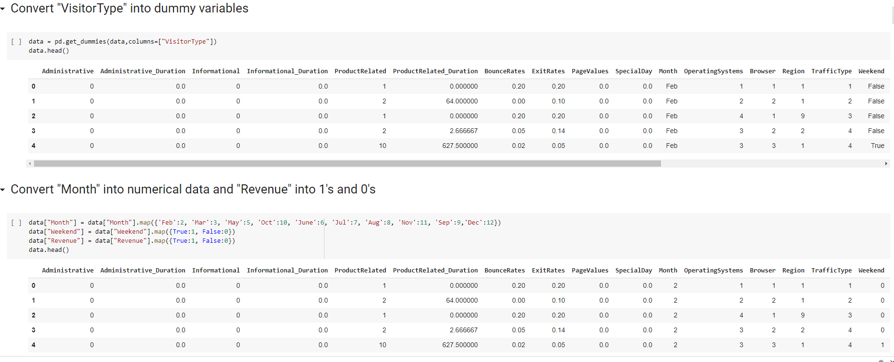
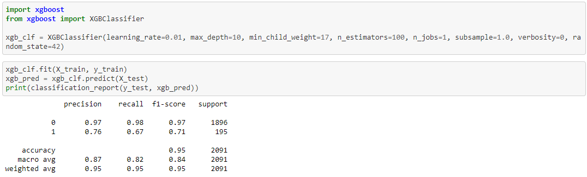
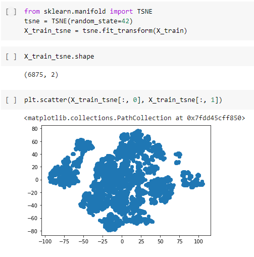
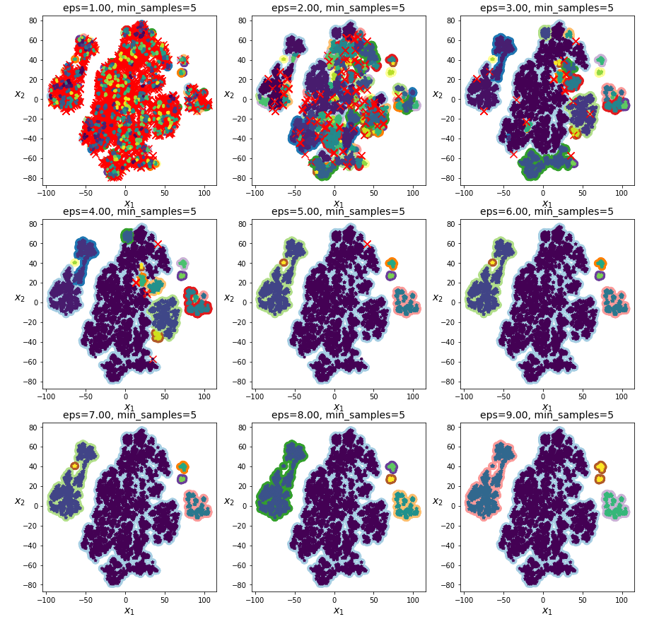
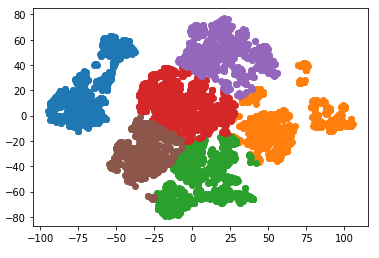
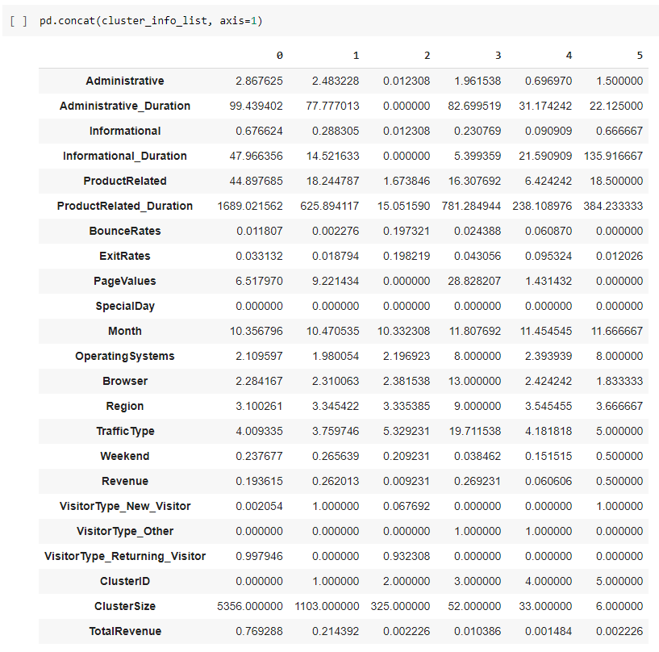
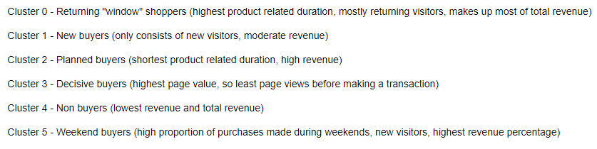

# online-shoppers-intent

Data analysis on the Online Shopping Behavior dataset from https://www.kaggle.com/henrysue/online-shoppers-intention

With Python, scikit-learn, pandas, numpy, matplotlib, seaborn

# Full [notebook on GitHub](https://github.com/theojl6/online-shoppers-intent/blob/main/Online_Shopping_Behavior_Analysis.ipynb)

# Or run on [Google Colab](https://colab.research.google.com/drive/1JmYUHHaSCO_xjC6BIizninYK-1j8Hroe?usp=sharing)
1. Download csv data from Kaggle
2. Upload csv to Google Drive
3. Change the path to the data as needed
4. Run notebook

# 1. Data handling

# 2. Model fitting to predict buyers / non-buyers, with Support Vector Machines, Random Forest Classifier, XGBoost Classifier
## Example for XGBoost

# 3. Data clustering with DBSCAN, k-means after dimensionality reduction with TSNE
## Using TSNE to reduce high number of dimensions (20 features)

## DBScan grid search

## K-means algorithm

# 4. Cluster assignments from analysis
## Table of features by cluster

## Cluster assignments

